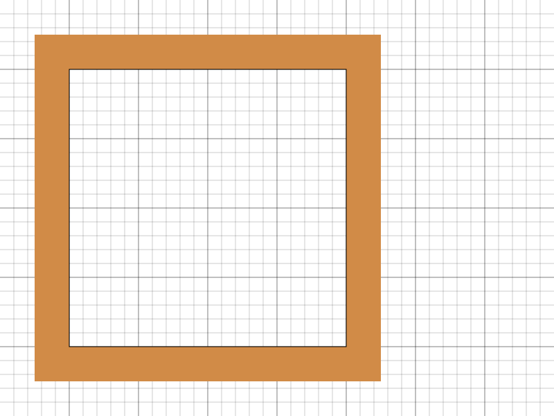
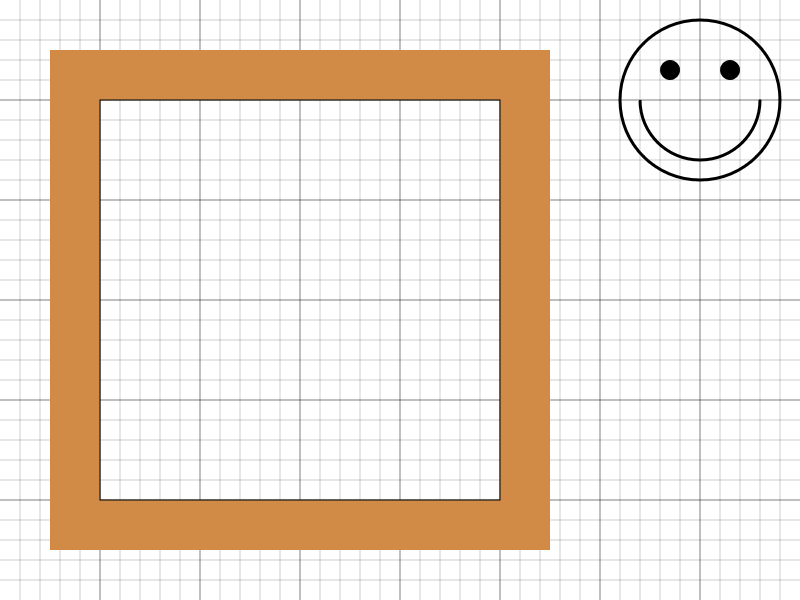
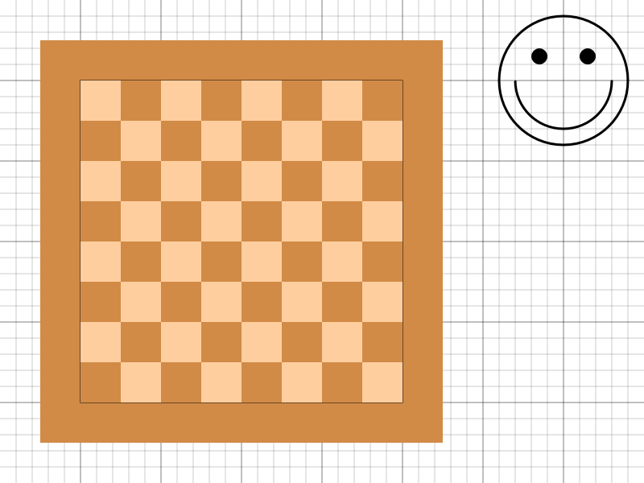
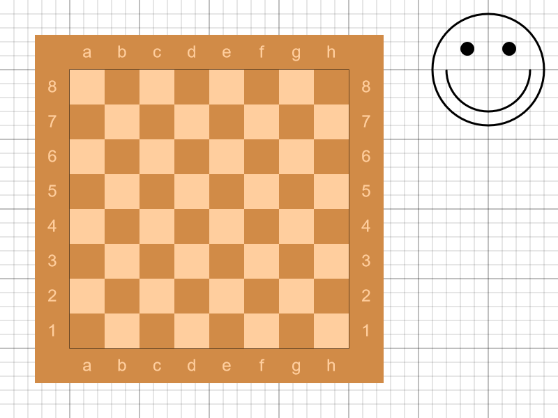
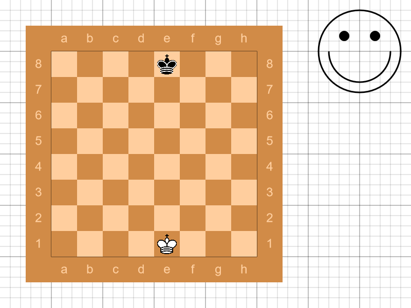
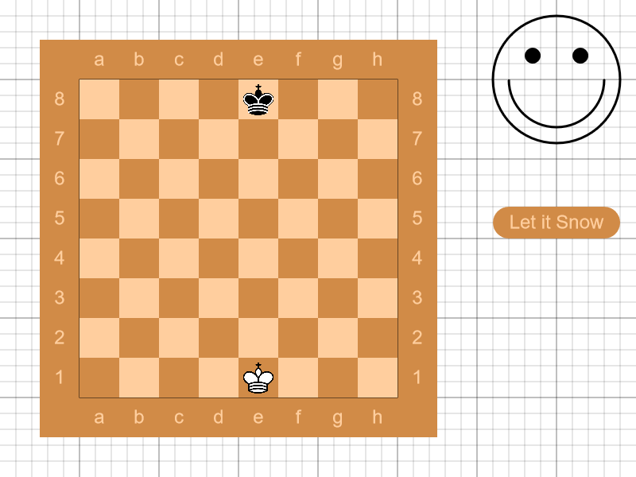
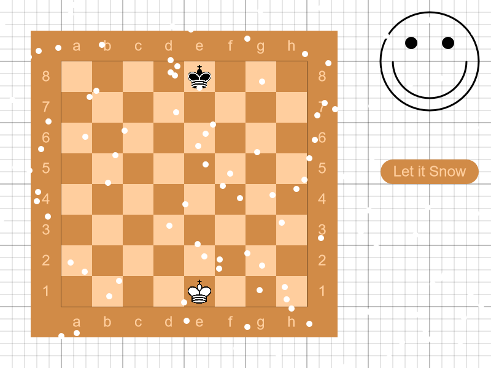

# Canvas API Exercise

1. Download project files and setup libraries
2. Add a Canvas element to **index.html**. Set its size to 800x600.
3. Create a function `grid` with no parameters which draws a grid spaced by 20 pixels with major lines every 100 pixels
- Use stroke style `rgba(0, 0, 0, 0.2)` for **minor** grid lines
- Use stroke style `rgba(0, 0, 0, 0.5)` for **major** grid lines
- Use line width of **1 pixel** for both types of lines

4. Set up constants for color styles
- `light: rgb(255, 206, 158)`
- `dark: rgb(209, 139, 71)`
5. Create a function `frame` with no parameters which draws a frame as shown in the example
- Use the **dark** color constant for the outer frame
- Use a **black** color for the inner frame

6. Create a function `smiley` with no parameters which draws a smiley face as shown in the example
- Use line width of **3 pixels** for all segments
- The eye segments are filled but not stroked

7. Create a function `rect` 
- It takes three parameters:
  - `file` is a number
  - `rank` is a number
  - `color` is a string that can be either **'light'** or **'dark'**
- When executed, the function draws a solid rectangle with size 50x50 at coordinates:
  - x = `file` * 50 + 100
  - y = `rank` * 50 + 100
  - The fill color is the constant, corresponding to the `color` parameter
8. Create a function `checker` which no parameters
  - It internally uses the `rect` function
  - It draw a checkerboard pattern as shown in the example

  
9. Create a function `labels` with no parameters which draws the labels on the files and ranks as shown in the example
- Use the **light** color constant to fill the text
- Configure context properties:
  - `font: 24px Arial`
  - `textAlign: center`
  - `textBaseline: middle`

10. Use the images included in the assets to draw both kings at **e1** and **e8**
- Note that the images **must** be resolved before they can be rendered: write code that executes the drawing methods after both assets fire a `load` event

11. Create a function `button`
- It takes two parameters:
  - `label` is a string
- The function draws a button shape as shown in the example
  - Use the **dark** color constant for the element
  - Use the **light** color constant for the label
  - Use the `label` parameter to draw the text of the label

12. Add click event listener to the canvas
- If the coordinates are within the bounding box of the button, show an alert using a system dialog
13. Create a function `snowflake`
- It takes two parameters
  - `x` is a number
  - `y` is a number
- It draws a white solid circle with radius 5 at the coordinates specified by the parameters
14. Set up an animation loop
- Create a function `clear` which clears the entire canvas
- Wrap all draw calls (if you haven't yet) in a function `render`
- At the beginning of the `render` function clear the canvas
- At the end of the `render` function, invoke `requestAnimationFrame(render)`
- Invoke the `render` function at the top-level of the code
15. Create a function `spawnSnowflake` with no parameters
- It returns an object with `x` and `y` numeric properties
- The `x` property is a random number between 0 and the width of the canvas
- The `y` property is set to 0 (the top of the canvas)
16. Set up snowing animation
- Create an empty array for snowflakes
- Every 5 animation frames, spawn a new snowflake using `spawnSnowflake`
- Every frame, increase the `y` coordinate of all snowflakes and draw them
- When a snowflake reaches the bottom of the canvas, remove it from the array
- **Note:** you should **not** modify the array while iterating it

17. Modify the button behaviour to toggle the snowfall instead of showing an alert
- When the snowfall is toggled on, snowflakes begin to spawn
- When it's toggled off, snowflakes stop spawning, but the existing ones remain in the scene, until they decay naturally at the bottom of the canvas
18. **BONUS:** Create a function that draws chess pieces using the provided spritesheet and draw the rest of the set
19. **BONUS:** Add logic for moving the chess pieces
- First click selects a piece to be moved
- On a second click, the piece is moved to the clicked tile
- If a piece already exists on the selected tile, remove it and place the moved piece
- There is no need to validate chess moves
- Draw some kind of indicator to show which piece has been selected (e.g., draw the underlying tile in an offset color)
